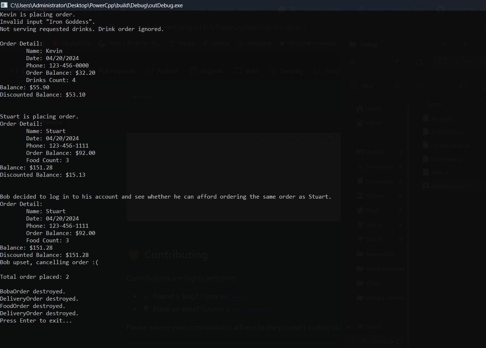

# 🥤 Food Ordering System


---

## 🌟 Introduction

Welcome to the **Food Ordering System**! This C++ project simulates a comprehensive food ordering application where users can:
- Order **boba teas** and food items.
- Apply **discounts** based on account status.
- Handle invalid inputs gracefully with custom exception handling.

This project showcases the power of **object-oriented programming** principles, including **inheritance**, **polymorphism**, and **exception handling**.

---

## 🚀 Features

✨ **Order Management**  
Easily place and manage orders for boba teas and food items.

✨ **Dynamic Discounts**  
Enjoy discounts based on account status: **Owner**, **VIP**, or **Regular**.

✨ **Robust Exception Handling**  
Gracefully handle invalid inputs with custom exceptions.

✨ **Detailed Receipts**  
Automatically generate professional, itemized receipts.

✨ **Polymorphism**  
Utilize polymorphism to seamlessly manage different order types.

---

## 🛠️ Installation

To get started with the Food Ordering System:

1. **Clone the Repository**  
   ```bash
   git clone https://github.com/Chungus1310/PowerCpp.git
   cd PowerCpp
   ```

2. **Compile the Project**  
   Ensure a C++ compiler (e.g., `g++`) is installed, then run:  
```bash
# Compile individual source files into object files
g++ -std=c++11 -Wall -Wextra -Wpedantic -Wshadow -Wformat=2 \
    -Wcast-align -Wconversion -Wsign-conversion -Wnull-dereference \
    -g3 -O0 -c Account.cpp -o ./build/Debug/Account.o

g++ -std=c++11 -Wall -Wextra -Wpedantic -Wshadow -Wformat=2 \
    -Wcast-align -Wconversion -Wsign-conversion -Wnull-dereference \
    -g3 -O0 -c BobaOrder.cpp -o ./build/Debug/BobaOrder.o

g++ -std=c++11 -Wall -Wextra -Wpedantic -Wshadow -Wformat=2 \
    -Wcast-align -Wconversion -Wsign-conversion -Wnull-dereference \
    -g3 -O0 -c FoodOrder.cpp -o ./build/Debug/FoodOrder.o

g++ -std=c++11 -Wall -Wextra -Wpedantic -Wshadow -Wformat=2 \
    -Wcast-align -Wconversion -Wsign-conversion -Wnull-dereference \
    -g3 -O0 -c DeliveryOrder.cpp -o ./build/Debug/DeliveryOrder.o

g++ -std=c++11 -Wall -Wextra -Wpedantic -Wshadow -Wformat=2 \
    -Wcast-align -Wconversion -Wsign-conversion -Wnull-dereference \
    -g3 -O0 -c Main.cpp -o ./build/Debug/Main.o

# Link all object files into a single executable
g++ -std=c++11 -Wall -Wextra -Wpedantic -Wshadow -Wformat=2 \
    -Wcast-align -Wconversion -Wsign-conversion -Wnull-dereference \
    -g3 -O0 ./build/Debug/Account.o ./build/Debug/BobaOrder.o \
    ./build/Debug/FoodOrder.o ./build/Debug/DeliveryOrder.o \
    ./build/Debug/Main.o -o ./build/Debug/outDebug.exe
   ```

3. **Run the Program**  
   ```bash
   ./build/Debug/outDebug.exe
   ```

---

## 📖 Usage

### ✅ Placing Orders  
Quickly place orders for food and boba teas:
```cpp
BobaOrder* kevinOrder = new BobaOrder("Kevin", "04/20/2024", "123-456-0000", 10.4f, "M Tea");
kevinOrder->addDrink("Green Tea Latte");
```

### ✅ Applying Discounts  
Apply dynamic discounts based on user account status:
```cpp
float discount = applyDiscount(order, kevin);
```

### ✅ Generating Receipts  
Generate professional receipts:
```cpp
order->receipt();
```

---

## 📦 Classes Overview

### 🛍️ DeliveryOrder
Handles delivery-specific details:
- **Attributes:** `name`, `date`, `phone`, `miles`, `orderBalance`
- **Methods:** `receipt()`, `getTotalBalance()`, `VIPdiscount()`

### 🧋 BobaOrder
Manages boba-specific orders:
- **Attributes:** `shopName`, `drinksCount`
- **Methods:** `addDrink()`, `receipt()`, `VIPdiscount()`

### 🍔 FoodOrder
Focuses on restaurant food orders:
- **Attributes:** `restaurantName`, `foodCount`
- **Methods:** `addFood()`, `receipt()`, `VIPdiscount()`

### 👤 Account
Defines user accounts:
- **Attributes:** `username`, `status`
- **Methods:** `getStatus()`

---

## 🎨 Visual Demo

Here’s a preview of how the system works:  


---

## 🤝 Contributing

Contributions are highly welcome!  
- **🐞 Found a bug?** Open an [issue](https://github.com/Chungus1310/PowerCpp/issues).  
- **💡 Have an idea?** Submit a [pull request](https://github.com/Chungus1310/PowerCpp/pulls).  

---

## 📧 Contact

Questions or feedback? Reach out to me via:  
- **GitHub:** [@Chungus1310](https://github.com/Chungus1310)  
